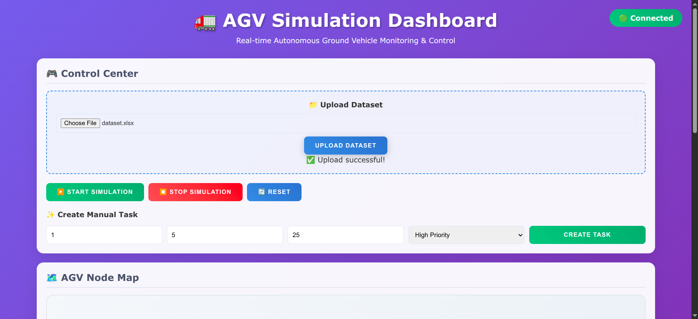
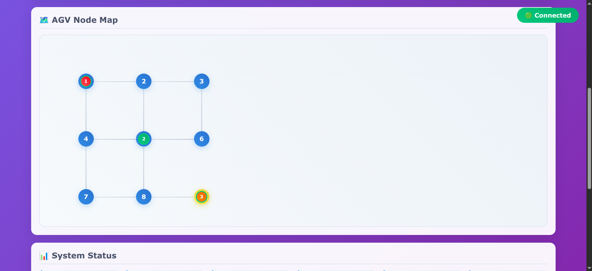
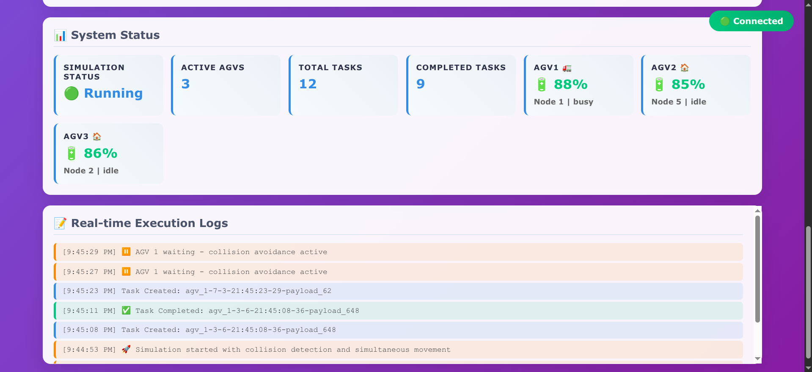
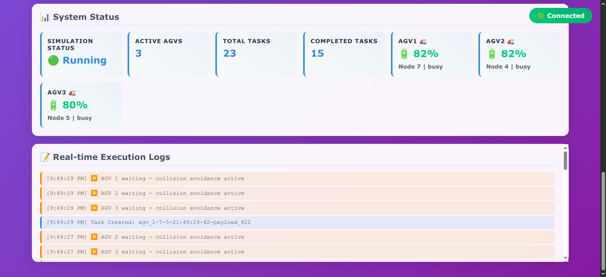
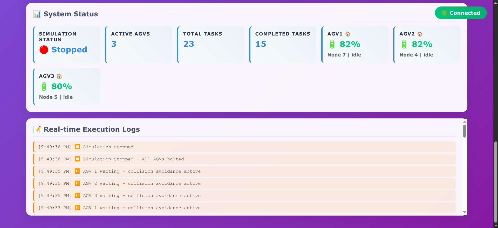

# 🤖 Dynamic AGV Scheduling System

✨ Project Highlight: This project was developed as part of Rockwell Automation’s RokConnect Hackathon, held in March 2025 at Pune Institute of Computer Technology, Pune.

🏆 Achievement: Secured **First Prize** among all participating teams.

<p align="center">
  
</p>

A comprehensive **Automated Guided Vehicle (AGV) scheduling and simulation system** with real-time collision detection, visual monitoring, and intelligent pathfinding algorithms.

##



## 🚀 Features

### Core Functionality
- **3 AGV Multi-Agent System** with simultaneous operation
- **Real-time Collision Detection** and avoidance
- **Visual Node Map Interface** with live position tracking
- **Smart Charging System** at designated charging station (Node 9)
- **Dataset Upload Support** (CSV/Excel files)
- **WebSocket Real-time Communication**
- **Performance Analytics** with detailed logging

### Movement & Navigation
- **No Diagonal Movement** - Only horizontal/vertical navigation
- **Advanced Pathfinding** using A* algorithm
- **Collision-Free Coordination** with global movement state
- **Charging Station Integration** with battery management



### Data Management
- **Custom Execution Log Format**: `agv_{num}-{start_node}-{end_node}-{HH:MM:SS}-{weight}-payload_{num}`
- **Real-time Performance Metrics**
- **Structured Data Export** (CSV, JSON)
- **System Event Logging**


### Node Network Topology
```
1 -- 2 -- 3
|    |    |
4 -- 5 -- 6
|    |
7 -- 8 -- 9 (Charging Station)
```



## 📋 Prerequisites

- **Node.js** (v14+ recommended)
- **npm** package manager
- **Web browser** (Chrome, Firefox, Safari)
## 🛠️ Installation & Setup

### 1. Clone the Repository
```bash
git clone https://github.com/SameerX64/Dynamic-AGV-Scheduling
cd Dynamic-AGV-Scheduling
```

### 2. Install Dependencies
```bash
cd backend
npm install
```

### 3. Quick Start
```bash
# Option 1: Use the automated script
./run_agv_system.sh

# Option 2: Manual start
cd backend
node server.js
```

### 4. Access the Dashboard
Open your browser and navigate to: **http://localhost:5000**





## 📊 Output Files & Logging

The system generates comprehensive logs and analytics:

### 📝 Execution Log Format
```
agv_1-3-7-14:30:45-25-payload_456
agv_2-1-9-14:31:12-30-payload_789
agv_3-5-2-14:31:28-15-payload_123
```

**Format Breakdown:**
- `agv_{num}`: AGV identifier (1, 2, or 3)
- `{start_node}`: Starting node (1-9)
- `{end_node}`: Destination node (1-9)
- `{HH:MM:SS}`: Execution timestamp
- `{weight}`: Task weight/priority
- `payload_{num}`: Unique payload identifier

### 📁 File Structure
```
output/
├── logs/
│   ├── system.log          # System events and errors
│   ├── execution.log       # AGV execution logs
│   └── performance.log     # Performance metrics
├── datasets/
│   ├── agv_data.csv        # AGV status data
│   └── performance.csv     # Performance analytics
└── analytics/
    └── analytics.json      # System analytics
```

### 📝 Execution Log Format
```
agv_1-3-7-14:30:45-25-payload_456
agv_2-1-9-14:31:12-30-payload_789
agv_3-5-2-14:31:28-15-payload_123
```

**Format Breakdown:**
- `agv_{num}`: AGV identifier (1, 2, or 3)
- `{start_node}`: Starting node (1-9)
- `{end_node}`: Destination node (1-9)
- `{HH:MM:SS}`: Execution timestamp
- `{weight}`: Task weight/priority
- `payload_{num}`: Unique payload identifier

##

### 👥 Team Members
- Sameer Dhande
- Ayush Deshmukh
- Akshay Patil
- Sahil Thakur

##
